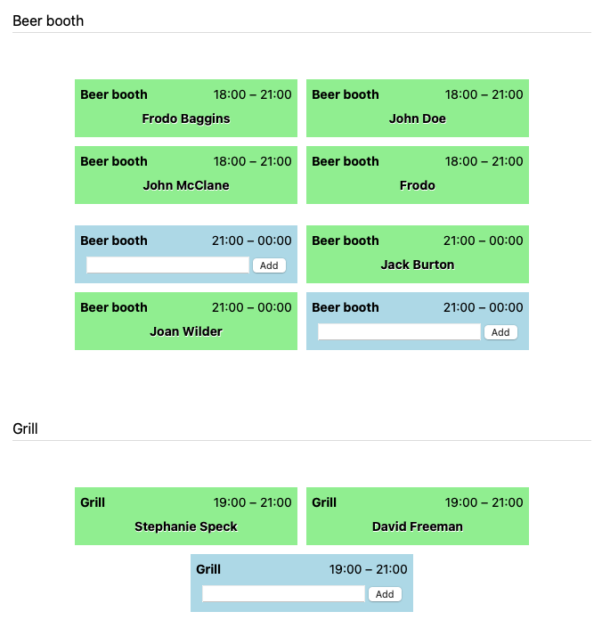

<h1 align="center">club-work-plan</h1>

name to be discussed
 

  

    A WordPress plugin to create a work schedule for a local festival so that the club can plan the responsibilities for
    members.
     
    <a href="http://www.schmaeddes.de"><strong>My Homepage</strong></a>
     

  

## 🛠 Getting Started

Copy the plugin into the `wp-content/plugins` folder and activate it via the `Plugins` menu in the admin interface.

## Usage

### Create an event

In the Club-WorkPlan Plugin, you can easily create an event by following these steps:

1. **Open the Plugin:** Navigate to the Club WorkPlan Plugin from your dashboard.
2. **Enter Event Details:**
   - Name: Provide a name for your event. Make it catchy and descriptive.
   - Description: Add a detailed description of your event. This helps participants know what to expect.
   - Date and Start Time: Select the actual date and start time for your event. Ensure it is accurate to avoid any confusion. 
3. **Save Your Event:** After filling in all the necessary details, click on the "Add new Event" button to create your event.

Congratulations! Your event is now created and will appear in the Club Workplan. 

### Add duties

Once you have clicked on an event, you will see a similar interface where you can create the services for that event. 
Follow these steps to add services:

1. **Open the Event:** Click on the event for which you want to create services.

2. **Enter Service Details:**
   - Duty Name: Provide a name for each service. Choose names that clearly describe the tasks.
   - Start and End Time: Specify the start and end times for each service to ensure proper scheduling.
   - Number of Services: Enter the number of services that need to be created. This helps in organizing multiple instances of the same service.
3. **Save Your Services:** After entering all necessary details, click the "Add duties" button to create the duties for the event.

### Add WorkPlan to a WordPress page

To display your WorkPlan on a WordPress page, follow these steps to add a custom field:

1. **Create or modify a page:** In your WordPress dashboard, go to Pages > Add New and create a new page.
2. **Enable Custom Fields:**
   - If the Custom Fields option is not visible, go to the top right corner and click on Screen Options.
   - Check the box for Custom Fields to enable them.
3. **Add a Custom Field:**
   - Scroll down to the Custom Fields section.
   - Click on Enter New to add a new custom field.
   - For the Name field, enter `cwp_event_id`.
   - For the Value field, enter the ID of the event that you want to display from the Club WorkPlan Plugin.
4. **Attach the Work Plan:**
   - Once the custom field is added and saved, the work plan for the specified event will be attached and displayed on the page.
   - Publish the Page: After adding the custom field, click on the Publish button to make the page live.
   
Your page is now set up to display the work plan associated with the specified event ID from the Club Workplan Plugin.

Anyone can now sign up for a service box without needing a user account. Therefore, it is advisable to share the page
only with members to ensure that only authorized individuals can access and register for the duties.